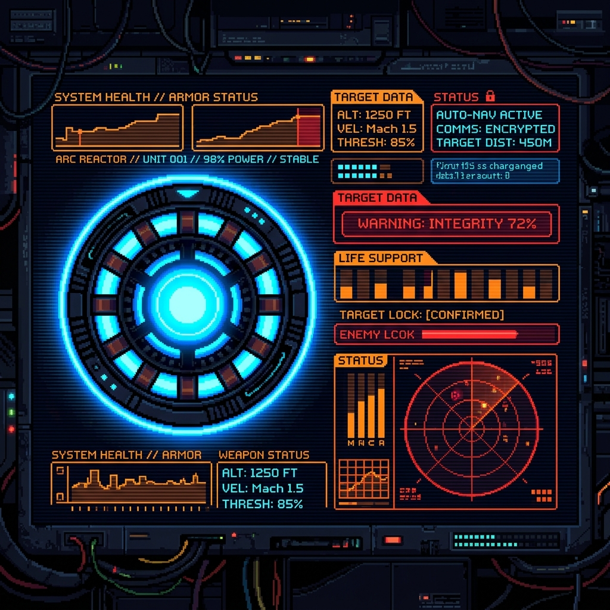
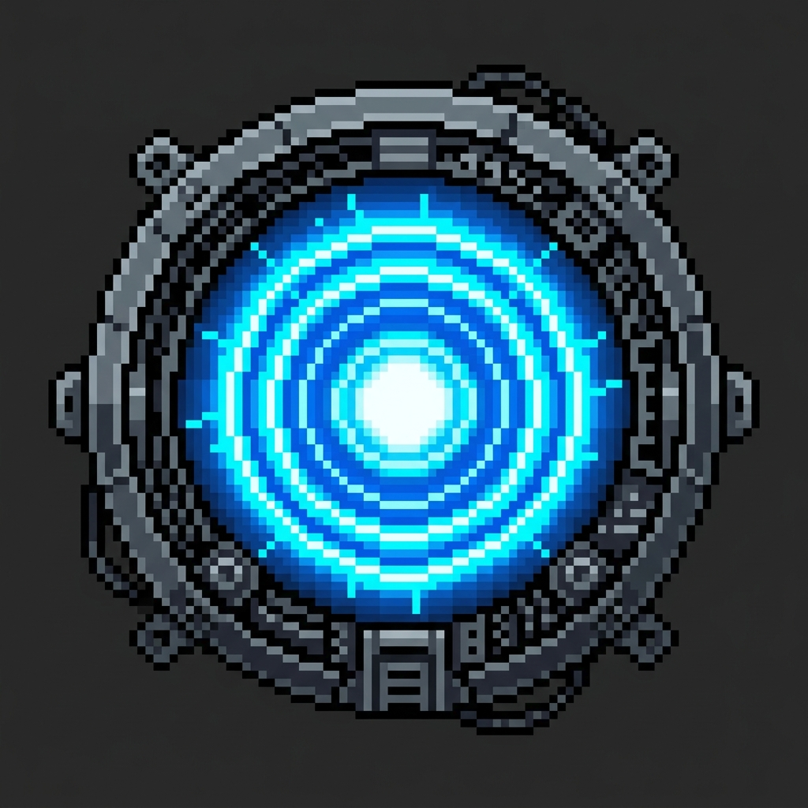

# 🖥️ STARK INDUSTRIES - SECURE TERMINAL PORTAL v3000

<div align="center">
  <!-- PIXEL ART BANNER -->
  

  <br/>
  
  <!-- RETRO GLITCH BADGES -->
  
  
  
  
  <br/>

  <h3>🤖 "I am Iron Man." — Welcome to my digital command center.</h3>
  
  <p><i>Deploying developer modules... Running protocols... Access Granted.</i></p>
</div>

<hr/>

## 📊 SYSTEM DIAGNOSTICS & TELEMETRY

```json
{
  "status": "ONLINE",
  "system_core": "Stark OS v90.4",
  "current_mission": "Building scalable software architectures & training neural networks",
  "arc_reactor_stability": "100%",
  "location": "Remote"
}
```

<table align="center" width="100%">
  <tr>
    <td width="50%" valign="top">
      <h3>📟 JARVIS Diagnostics</h3>
      <ul>
        <li><strong>⚡ Operational Status:</strong> Active & compilation ready</li>
        <li><strong>🧬 Primary Directives:</strong> Machine learning, full-stack design, automation</li>
        <li><strong>🔥 Core Focus:</strong> Optimizing execution times, reducing latency, and pixel-perfect UIs</li>
        <li><strong>🔌 Connectivity:</strong> Git / SSH Protocol V2</li>
      </ul>
    </td>
    <td width="50%" valign="top" align="center">
      
      <br/>
      <sub><b>Arc Reactor Core Status:</b> Active</sub>
    </td>
  </tr>
</table>

<hr/>

## 🛠️ SUIT MODULES (TECH STACK)

My tech stack is organized by the subsystems of the **Mark LXXXV Armor**:

### 🧠 Tactical HUD (Frontend & Design)
> *High-fidelity visual feedback, real-time data stream interfaces, and intuitive interactive controls.*

<p align="left">
  <a href="https://developer.mozilla.org/en-US/docs/Web/JavaScript" target="_blank" rel="noreferrer">
    
  </a>
  &nbsp;
  <a href="https://www.typescriptlang.org/" target="_blank" rel="noreferrer">
    
  </a>
  &nbsp;
  <a href="https://reactjs.org/" target="_blank" rel="noreferrer">
    
  </a>
  &nbsp;
  <a href="https://nextjs.org/" target="_blank" rel="noreferrer">
    
  </a>
  &nbsp;
  <a href="https://tailwindcss.com/" target="_blank" rel="noreferrer">
    
  </a>
  &nbsp;
  <a href="https://www.w3.org/html/" target="_blank" rel="noreferrer">
    
  </a>
  &nbsp;
  <a href="https://www.w3schools.com/css/" target="_blank" rel="noreferrer">
    
  </a>
</p>

### ⚡ Arc Reactor (Backend, API & Systems Logic)
> *The core engine powering calculations, data pipelines, business logic, and server operations.*

<p align="left">
  <a href="https://nodejs.org" target="_blank" rel="noreferrer">
    
  </a>
  &nbsp;
  <a href="https://expressjs.com" target="_blank" rel="noreferrer">
    
  </a>
  &nbsp;
  <a href="https://www.python.org" target="_blank" rel="noreferrer">
    
  </a>
  &nbsp;
  <a href="https://golang.org" target="_blank" rel="noreferrer">
    
  </a>
</p>

### 💾 Cybernetic Memory Banks (Databases & Cache)
> *Highly indexed, fault-tolerant repositories storing diagnostic histories, target data, and logs.*

<p align="left">
  <a href="https://www.mongodb.com/" target="_blank" rel="noreferrer">
    
  </a>
  &nbsp;
  <a href="https://www.postgresql.org/" target="_blank" rel="noreferrer">
    
  </a>
  &nbsp;
  <a href="https://redis.io/" target="_blank" rel="noreferrer">
    
  </a>
</p>

### 🛡️ Flight Thrusters & Shields (DevOps, Cloud & Tools)
> *Autonomous deployment vectors, secure shell protection, and environment isolated processes.*

<p align="left">
  <a href="https://www.docker.com/" target="_blank" rel="noreferrer">
    
  </a>
  &nbsp;
  <a href="https://aws.amazon.com/" target="_blank" rel="noreferrer">
    
  </a>
  &nbsp;
  <a href="https://firebase.google.com/" target="_blank" rel="noreferrer">
    
  </a>
  &nbsp;
  <a href="https://git-scm.com/" target="_blank" rel="noreferrer">
    
  </a>
</p>

<hr/>

## 🎯 MISSION ARCHIVES (FEATURED PROJECTS)

| Project / Repository | Description | Status | Mark Level |
| :--- | :--- | :---: | :---: |
| [📂 project-neural-hud](https://github.com/Sylester7/project-neural-hud) | Pixel-art HUD generator for custom computer displays. | `COMPLETED` | Mk. 85 |
| [📂 arc-power-api](https://github.com/Sylester7/arc-power-api) | Distributed backend telemetry API for smart grids. | `ACTIVE` | Mk. 42 |
| [📂 jarvis-voice-assistant](https://github.com/Sylester7/jarvis-voice-assistant) | Lightweight desktop utility script mapping hotkeys to LLM models. | `OPTIMIZING` | Mk. 5 |

<hr/>

## 📈 TELEMETRY ANALYTICS (GITHUB STATS)

<div align="center">
  <a href="https://github.com/Sylester7">
    
  </a>
  <a href="https://github.com/Sylester7">
    
  </a>
  
  <br/>
  <br/>
  
  <a href="https://github.com/Sylester7">
    
  </a>
</div>

<hr/>

## 📟 COMMUNICATION CHANNELS

```
┌─────────────────────────────────────────────────────────┐
│  📡 LINKEDIN:  linkedin.com/in/Sylester7                │
│  📧 EMAIL:     your.email@starkindustries.com           │
│  🌐 PORTFOLIO: starkindustries.com/tony-stark            │
└─────────────────────────────────────────────────────────┘
```

---

<div align="center">
  <sub>JARVIS Protocols v3.8.5. Designed with 💖 and 8-bit tech.</sub>
</div>
